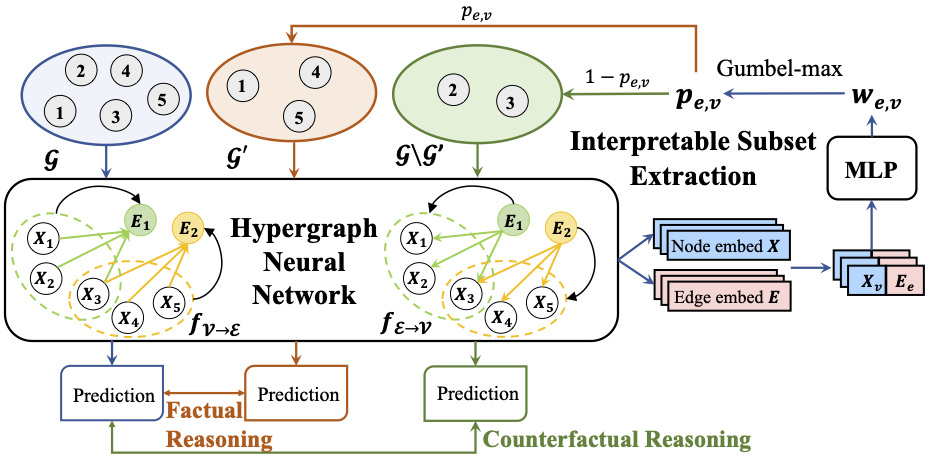

# CACHE
This repo contains our code for paper Counterfactual and Factual Reasoning over Hypergraphs for Interpretable Clinical Predictions on EHR, in Proceedings of 2nd Machine Learning for Health symposium 2022 (ML4H 2022).

## Model Framework



## Data

Due to the privacy issue, we only provide a toy dataset in [data](data) (TODO).

## Package 
- PyTorch 1.4
- python 3.7
- tqdm
- torch-scatter 2.0.4
- torch-sparse 0.6.0
- torch-cluster 1.5.2
- torch-geometric 1.6.3
- sklearn

## Run the Code
Please use `run.sh` (TODO) to run the code for the toy dataset in [data](data) as an example.

## Citation

If you find this paper useful for your research, please cite the following in your publication. Thanks!
```
@inproceedings{
xu2022counterfactual,
title={Counterfactual and Factual Reasoning over Hypergraphs for Interpretable Clinical Predictions on EHR},
author={Ran Xu and Yue Yu and Chao Zhang and Mohammed K Ali and Joyce Ho and Carl Yang},
booktitle={Machine Learning for Health 2022},
year={2022},
}
```
